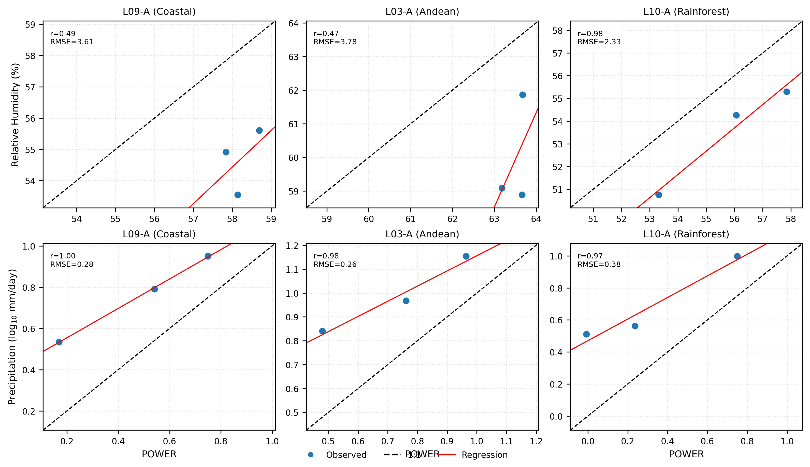

# Consistency Analysis Base Dataset (NASA POWER vs ERA5/ERA5-Land)

This repository structure contains the reproducible **daily-level base dataset** used to evaluate consistency between NASA POWER and ERA5/ERA5-Land for four atmospheric variables:

- `SP`  : Surface Pressure
- `T`   : Air Temperature
- `RH`  : Relative Humidity
- `PRECI`: Precipitation

## Recommended use

This package is intended to reproduce:
1. consistency metrics (`r`, `bias`, `RMSE`, `MAE`),
2. rankings by variable and site,
3. publication-ready scatter plots,
4. the combined IEEE-style figure.

## Folder structure

- `data/daily_pairs.csv`  
  Paired daily observations POWER vs ERA5/ERA5-Land. This is the **reproducible base dataset** currently available.

- `data/metrics_all.csv`  
  Precomputed metrics by site and variable.

- `metadata/sites_locations_AB.csv`  
  Mapping between site identifiers and link endpoint names.

- `metadata/sites_regions_AB.csv`  
  Mapping between site identifiers and climatic region labels.

- `scripts/consistency_pipeline_github.py`  
  Full pipeline script for consistency analysis.

- `figures/consistency_combined_ieee.png`  
  Combined publication-style figure (RH top row, PRECI bottom row).

## Important note about reproducibility level

Two reproducibility levels are possible:

### A. Raw-hourly reproducibility (ideal)
Requires:
- `power_hourly.csv`
- `era5_hourly.csv`

These files should contain the long-format structure:

`datetime,site,var,value`

### B. Daily-paired reproducibility (current package)
Uses:
- `daily_pairs.csv`

This is the currently available dataset and is sufficient to reproduce:
- all reported consistency metrics,
- rankings,
- final scatter figures.

## Columns in `daily_pairs.csv`

- `date_utc`
- `site`
- `location`
- `var`
- `power`
- `era5`
- `coverage_power`
- `coverage_era5`
- `n_hours_power`
- `n_hours_era5`

## Example command

```bash
python scripts/consistency_pipeline_github.py \
  --power power_hourly.csv \
  --era5 era5_hourly.csv \
  --locations metadata/sites_locations_AB.csv \
  --regions metadata/sites_regions_AB.csv \
  --outdir report_out \
  --year 2024
```

If raw hourly inputs are not available, `daily_pairs.csv` should be considered the reference dataset for public sharing and figure reproduction.

## Consistency analysis (ERA5 vs NASA POWER)
<p align="center">
  
</p>

**Figure.** Consistency assessment between ERA5/ERA5-Land and NASA POWER datasets for precipitation and relative humidity across representative radio links in Peru. The dashed line represents the ideal 1:1 agreement, while the solid line corresponds to the fitted regression model.

